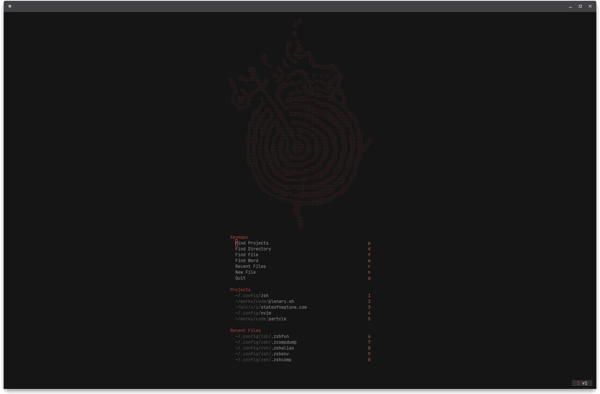

# .neovim

Neovim configuration using AstroNvim v5.

## Dashboard



Colorscheme: [ashen](https://www.github.com/ficcdaf/ashen.nvim)

## Installation

### Make a backup of your current nvim and shared folder

```shell
mv ~/.config/nvim ~/.config/nvim.bak
mv ~/.local/share/nvim ~/.local/share/nvim.bak
mv ~/.local/state/nvim ~/.local/state/nvim.bak
mv ~/.cache/nvim ~/.cache/nvim.bak
```

### Clone the repository

```shell
git clone https://github.com/nin93/.neovim ~/.config/nvim
```

### Start Neovim

```shell
nvim
```
